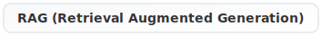

  

&nbsp;&nbsp;

&nbsp;&nbsp;

&nbsp;&nbsp;

 

🚀 <strong>Explore more on personal website:</strong> <a href="https://aradhyapavan.github.io" target="_blank">https://aradhyapavan.github.io</a>

 

<table style="width: 100%; table-layout: fixed;">
<tr>
<td colspan="2" align="center">

  
</td>
</tr>
<tr>
<td width="50%" valign="top" style="padding: 10px; word-wrap: break-word;">

 

**M.Tech AI/ML from BITS Pilani | NLP Specialization**

 

<table style="width: 100%; font-size: 12px; table-layout: fixed;">
<tr><td width="15px">🤖</td><td><strong>Focus</strong> Translating data challenges into scalable solutions</td></tr>
<tr><td>🧩</td><td><strong>Tech Stack</strong> Python • AI/ML & NLP Systems • Idea → Impact</td></tr>
<tr><td>🌟</td><td><strong>Interests</strong> 💻 Technology 🏎️ F1 Racing 🚀 Space 🬠Movies & TV Shows 🌠Geopolitics</td></tr>
</table>

</td>
<td width="50%" valign="top" style="padding: 10px; word-wrap: break-word;">

 

> *Building useful intelligent systems that people can actually use*

 

<table style="width: 100%; font-size: 12px; table-layout: fixed;">
<tr><td width="15px">ğŸ</td><td><strong>Hackathons</strong> Regular participant with wins</td></tr>
<tr><td>⚡</td><td><strong>Explore</strong> Different tech, GPUs, distributed systems</td></tr>
<tr><td>🛠️</td><td><strong>Philosophy</strong> Design, functionality, UX</td></tr>
<tr><td>🔄</td><td><strong>Quick Learner</strong> Adapt fast to new domains</td></tr>
</table>

 

</td>
</tr>
</table>

 

 

##  Tech Arsenal

### 🤖 Machine Learning, AI & Agentic Frameworks

### 🌐 Web Development, Tools & Cloud Platforms

### 🧠 Advanced AI & NLP Technologies

 

### 🎯 Current Focus

---

### 🧠 My Journey & Expertise Map

```mermaid
%%{init: {'theme':'dark', 'themeVariables': {'primaryColor':'#2563eb','primaryTextColor':'#ffffff','primaryBorderColor':'#06b6d4','lineColor':'#06b6d4','sectionBkgColor':'#1e40af','altSectionBkgColor':'#3730a3','gridColor':'#374151','secondaryColor':'#dc2626','tertiaryColor':'#059669'}}}%%
mindmap
  root((Aradhya Pavan))
    Tech Stack
      🐍 Python
        PyTorch
        TensorFlow
        Pandas & NumPy
        MLflow
      🌐 Web Dev
        PHP
        JavaScript
        HTML/CSS
        APIs
      ☁️ Cloud & DevOps
        AWS
        Azure
        Docker
        Heroku
    AI/ML Expertise
      🤖 Machine Learning
        Model Training
        Model Deployment
        MLOps Pipeline
      🧠 NLP Specialist
        spaCy
        Hugging Face
        Language Models
      🔗 Agentic AI
        LangChain
        Phidata
        Agent Frameworks
      📊 Data Science
        Vector Databases
        RAG Systems
        Prompt Engineering
    Current Focus
      🔬 Scalable AI Systems
      ⚡ GPU Computing
      🏗️ Distributed Systems
      🛠️ Building Tools
    Goals & Interests
      🏎️ Formula 1 Analytics
      🏆 Hackathon Wins
      📝 POCs to MVPs
      💎 Open Source
```

---

##  GitHub Analytics

  
  

  

 

<!-- Hidden visitor tracker -->

### 📫 Let's Connect & Build Something Amazing Together!

*"I focus on what matters: design, functionality, user experience, and attention to detail"*

**🙏 From [aradhyapavan](https://github.com/aradhyapavan) with ❤️**

